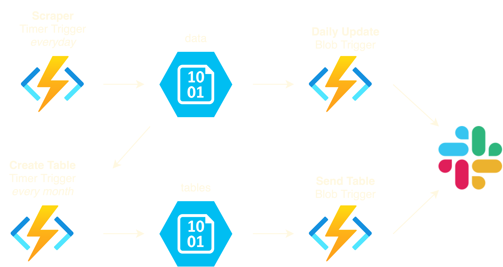

# organization-pr-scanner

Azure Functions app for scraping pull request, user and project data for all members of a GitHub organization. The resulting dataset is used for a set of features:

* A Slack message informing others when new pull requests are detected.
* A (monthly) tabular report which lists some elementary information about the pull requests of the past period.

## Overview

## Setup
To use this project for your organization,
* Fork the repository.
* Setup an Azure Functions app that will host the project
* Store the publish profile in the GitHub Actions secrets, according to the naming in [cd.yml](https://github.com/godatadriven/organization-pr-scanner/blob/main/.github/workflows/cd.yml)

Also, add the following variables to the Functions app's Application Settings: 
* `ORGANIZATION`, the name of your GitHub organization.
* `GITHUB_TOKEN`, a GitHub access token that provides access to the organization.
* `SLACK_BOT_TOKEN`, a Slack API authentication token for sending updates to a Slack workspace.
* `SLACK_BOT_CHANNEL`, the channel to which the updates are sent.
* `MINIMUM_STARS`, the minimum number of stars that is required for a PR to be listed in the tables and messages.
